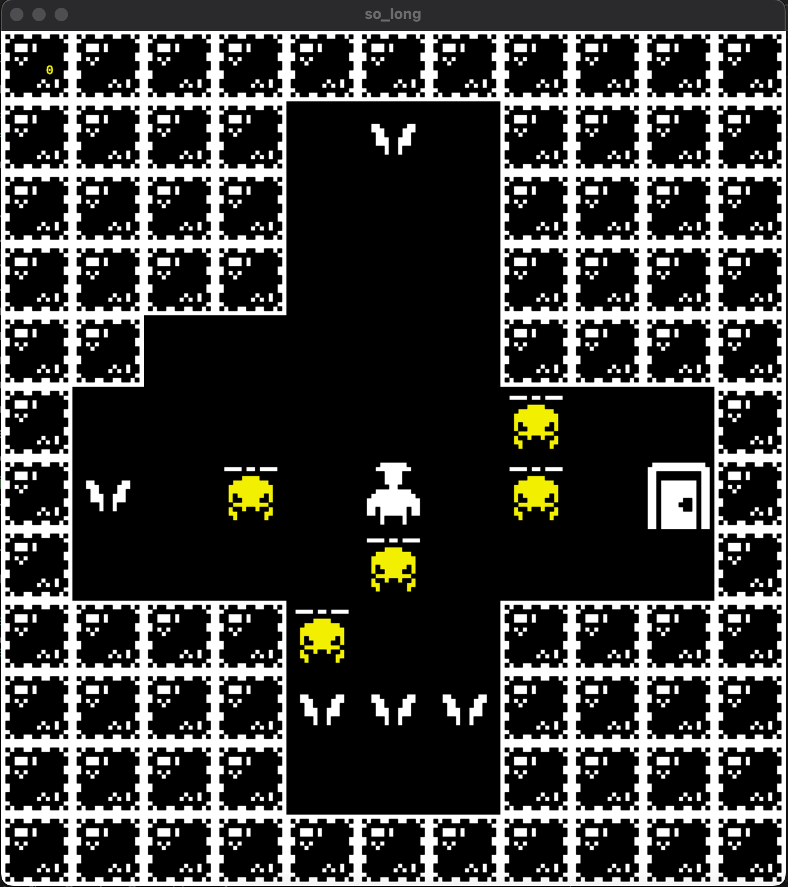
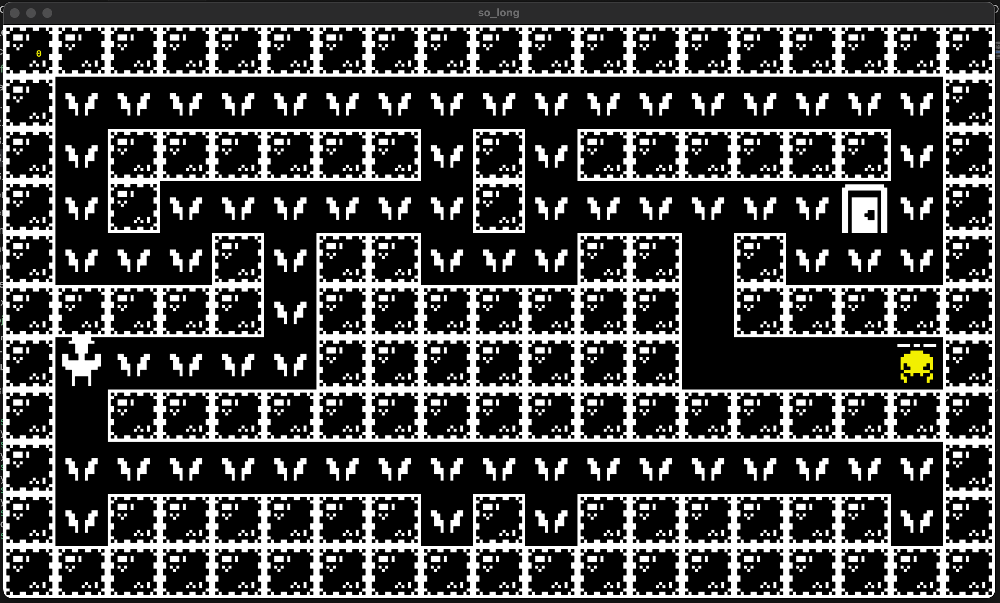

# So_Long

So_Long is a 2D game written in C language using the miniLibX graphic library. The game features a simple gameplay where the player must collect all coins to open the door and reach the exit. However, if the player collides with an enemy, the game is over. 

## Project Description

So_Long is a simple game where the player navigates a character through a maze-like environment to collect coins while avoiding enemies. The objective is to collect all coins and reach the door to win the game. The player moves the character using arrow keys or WASD keys.

The project also includes a feature where users can input their own maps and execute the program with their custom map designs, adding an element of creativity and customization to the gameplay experience.

## Screenshots

## Usage

To play So_Long, compile the program using the provided Makefile and execute it with the map file as an argument:

1. `git clone https://github.com/arsenbadalyan/so_long.git`
2. `cd so_long`
3. `make`
2. `./so_long maps/map_name.ber`
3. Enjoy the game

## Custom Maps

Users can create their own maps by following the format specified in the map files provided. Each character in the map represents a different element:
- `1`: Wall
- `0`: Empty space
- `C`: Coin
- `P`: Player character
- `V`: Enemy
- `E`: Door

## Dependencies

- miniLibX library (project includes this lib)

## Contributors

- [Arsen Badalyan](https://github.com/arsenbadalyan)

## License

This project is licensed under the MIT License - see the [LICENSE](LICENSE) file for details.
